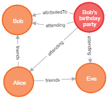
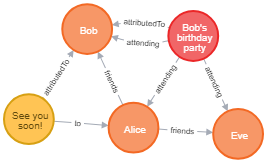

# ActivityGraph demo

As an example, I'll walk through a demo of both querying the graph and sending requests to ActivityPub. For this demo, I will use the example of an event planner. Users can create and attend events and post to events or their friends.

Before doing this demo, make sure you have followed the setup steps as shown in the readme and have a MongoDB instance and Neo4j graph running.

## Graph queries

I will use `testcases.py` as an example here. Take the first four queries:

```
CREATE (a:Person {name:'Alice'}), (b:Person {name:'Bob'}), (c:Person {name:'Eve'})
```

```
MATCH (a), (b)
WHERE a.name = "Alice" AND NOT b.name = "Alice"
CREATE (a)-[r:friends]->(b)
```

```
MATCH (b)
WHERE b.name = "Bob"
CREATE (e:Event {name:"Bob's birthday party", date:"01-01-2021", location:"Nijmegen", description:"More info soon to follow."})-[r:attributedTo]->(b)
```

```
MATCH (a), (e)
WHERE e.name = "Bob's birthday party" AND (a.name = "Alice" OR a.name = "Bob" OR a.name = "Eve")
CREATE (e)-[r:attending]->(a)
```

These queries will respectively:
1. Create users Alice, Bob and Eve
2. Add Bob and Eve as Alice's friends
3. Create an event for Bob's birthday, which naturally is attributed to Bob
4. Add Alice, Bob and Eve as guests to the party

These queries can be sent using checkQuery, a function imported from `cypher_read`. This will edit the query, parse it using Neo4j, send it to the graph and sync the changes to ActivityPub. If you first want to experiment with queries and see how they are edited without actually sending them to the graph, use the optional argument `testing=True`. For the fourth query, this will return:

```
MATCH (a), (e)
WHERE e.name = "Bob's birthday party" AND (a.name = "Alice" OR a.name = "Bob" OR a.name = "Eve")
CREATE (e)-[r:attending {graph_status:'new'}]->(a)
```

As you can see, the changes to the query are minimal (simply adding a graph_status), but this will make it possible for the code to identify which nodes and edges need to be synced to ActivityPub.

Sending those four queries results in the following graph:



## ActivityPub requests

Now you have some users and an event, which are synced to ActivityPub as Actors and Activities. Run `app.py` so you can send requests. You can do GET requests by simply visiting `localhost:5000`. For example, if you go to `http://localhost:5000/user/bob/outbox`, you should now see Bob's birthday party enclosed in an OrderedCollection. You can find all items posted to Bob's outbox here, but this should currently be just one item.

If you want to POST something yourself, see the following example:

```
{
  "to": ["http://localhost:5000/alice"],
  "type": "Create",
  "object": {
    "type": "Post",
    "message": "See you soon!",
    "attributedTo": "http://localhost:5000/bob"
  }
}

```

When you post this request to the server (in my case I posted it to Alice's inbox, `http://localhost:5000/user/alice/inbox`), it will get converted to an activity which encloses a "Post" object with message "See you soon!". This message is attributed to Bob, and as Alice is the only recipient, it gets forwarded to her. If you visit `http://localhost:5000/user/alice/inbox`, you will now see the message in her inbox. As this message has both links to Alice and Bob, we should see this represented in our graph now:



If you want to edit or delete an activity, you send a request to the server with type "Edit" or "Delete" which contains an object with the id of the activity you want to edit/remove. For example, if I want to do something with Bob's message, I look for the url of that message. In my case, this was `http://localhost:5000/alice/inbox/4ba022282818e54f`, but if you look in Alice's inbox you will find which one you need to use. A (minimal) update request will look something like this:

```
{
  "to": ["http://localhost:5000/alice"],
  "type": "Update",
  "object": {
    "id": "http://localhost:5000/alice/inbox/4ba022282818e54f",
    "message": "Hi there!"
  }
}
```

Once you send this (for example to Alice's inbox), both the activity and the corresponding node will remain, but as you overwrite the message, that will change.

A (minimal) delete request will look something like this:
```
{
  "to": ["http://localhost:5000/alice"],
  "type": "Delete",
  "object": {
    "id": "http://localhost:5000/alice/inbox/4ba022282818e54f"
  }
}
```

Once you've sent this request, the original activity will disappear, and a so called Tombstone with the original id remains, which signals that this activity does no longer exist:

```
{
  "@context": "https://www.w3.org/ns/activitystreams",
  "id": "http://localhost:5000/alice/inbox/4ba022282818e54f",
  "type": ["Tombstone"]
}
```

These are the basics of working with ActivityGraph, I hope this helps!

