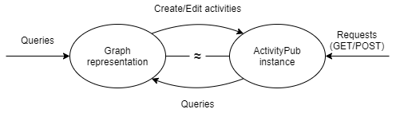

ActivityGraph enables users to query ActivityPub in the way they are used to with graphs.

## How does it work?

It keeps two separate datasets: one ActivityPub instance and one graph representation of that instance. These two can receive requests or queries, respectively, and because they need to represent the same data, they also update each other.



## What do I need?

The application uses Neo4j, Flask and MongoDB. Alternative database options are available in the code, as the ActivityPub instance runs using the Python library as published at [dsblank/activitypub](https://github.com/dsblank/activitypub).

## Graph

Queries are handled by `cypher_read.py`. Using `checkQuery`, you can pass Cypher queries, which will then be modified and sent to Neo4j.

Updates to the ActivityPub instance are then handled by `check_db.py`: `checkForUpdates` is called, and all marked nodes/edges are updated in the instance.

Some example queries have been provided (```testcases.py```). Add further activities and actors using queries on the graph or requests to the application.

### Supported queries

`CREATE`, `SET`, `DELETE` and `DELETE DETACH` are implemented. Queries that contain these keywords are modified, so that affected nodes and edges can also be synced to the ActivityPub instance. You can of course also use the standard query terms like `MATCH` and `RETURN`, these are unaffected during modification.

## ActivityPub

Run the application using:

```python app.py```

To interact with the application, send GET/POST requests to:

```localhost:5000/[user]/outbox```  
```localhost:5000/[user]/inbox```

E.g. for the provided queries in ```testcases.py```, check ```/alice/outbox``` and ```/bob/outbox```.

After sending POST requests to an inbox, `update_db.py` is called, which processes the newly added activities and modifies both the instance and the graph representation.

### Supported activities

`Create`, `Update`, `Delete` are implemented. When POST-ing objects to inbox of a user, the application checks whether it has received a valid activity that has one of these types AND contains a nested object. If so, this nested object is processed accordingly. Otherwise, the activity is processed as a 'normal' object and gets added to a newly created `Create` activity. However, when POST-ing an Update or Delete activity, make sure that your nested object includes a valid, existing id, otherwise it will not work and it will just be deleted.
